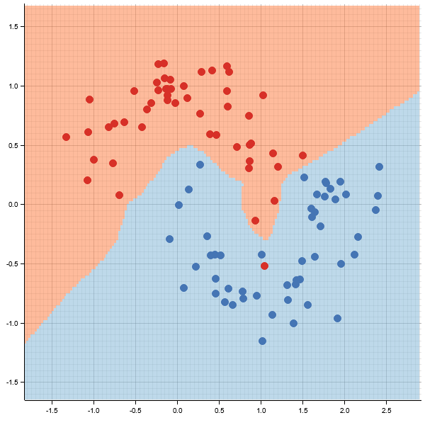

## Micrograd in Rust

This project is a Rust implementation of Andrej Karpathy's *[Micrograd](https://github.com/karpathy/micrograd)*, a tiny autograd engine for scalar-valued automatic differentiation and neural network training. Inspired by Karpathy's educational approach to building neural networks from scratch, this codebase replicates the core functionality of *Micrograd* in Rust, providing a lightweight framework for learning and experimenting with deep learning concepts.

## Overview

*Micrograd* is designed to teach the fundamentals of neural networks by implementing backpropagation (reverse-mode autodiff) over a dynamically built computation graph. This Rust port maintains the simplicity and clarity of the original Python implementation while leveraging Rust's performance and type safety. The project includes both the autograd engine and a small neural network library with a PyTorch-like API.

The codebase is divided into three main modules:

- **engine.rs**: Defines the `Value` struct, the core of the autograd system. It supports operations like addition, multiplication, ReLU activation, and backward propagation for gradient computation.
- **nn.rs**: Implements neural network components including `Neuron`, `Layer`, and `MLP` (Multi-Layer Perceptron) structs. These follow a modular design with a `Module` trait for managing parameters and gradients.
- **main.rs**: Contains the training loop, data generation for the "two moons" dataset, loss computation (SVM max-margin loss with L2 regularization), and visualization of the decision boundary using the `plotters` crate.

## Features

- **Automatic Differentiation**: The `Value` struct tracks operations and builds a computation graph to compute gradients via backpropagation.
- **Neural Network Components**: Supports construction of multi-layer perceptrons with configurable layer sizes and ReLU non-linearities.
- **Training**: Implements a simple stochastic gradient descent (SGD) optimizer with a decaying learning rate.
- **Visualization**: Generates a decision boundary plot for the trained model on the two moons dataset, saved as `decision_boundary.png`.

## Dataset

The project uses a synthetic "two moons" dataset, which consists of two interleaving half-circles with added noise. This dataset is commonly used to test binary classification models as it requires learning a non-linear decision boundary.

- **Generation**: The `generate_moons` function creates `n_samples` points, split evenly between the two classes, with configurable noise and random seed.
- **Labels**: Class labels are `1.0` for one moon and `-1.0` for the other.

## Model Architecture

The default model in `main.rs` is an MLP with:
- Input layer: 2 dimensions (corresponding to the x, y coordinates of data points).
- Hidden layers: Two layers with 16 and 32 neurons respectively, each followed by ReLU activation (except the output layer).
- Output layer: 1 neuron for binary classification.

## Loss Function

The loss function combines:
- **SVM Max-Margin Loss**: Encourages correct classification with a margin, computed as `relu(1 - y * score)` for each sample, where `y` is the true label and `score` is the model's output.
- **L2 Regularization**: Adds a penalty on the squared weights to prevent overfitting, scaled by a factor of `1e-4`.

## Training

The training loop runs for 100 iterations:
- Computes the total loss on the full dataset.
- Performs backpropagation to calculate gradients.
- Updates weights using SGD with a learning rate that decays from 1.0 to 0.1 over the iterations.
- Prints loss and accuracy every 10 steps.

## Visualization

After training, the `visualize_decision_boundary` function creates a grid over the data space, evaluates the model's output at each grid point, and colors regions based on the predicted class. Data points are overlaid with distinct colors for each class. The result is saved as `decision_boundary.png`.

## How to Run

1. **Prerequisites**: Ensure you have Rust and Cargo installed on your system.
2. **Dependencies**: The project uses crates like `rand`, `rand_distr`, and `plotters` for data generation and visualization. Add these to your `Cargo.toml`:
   ```toml
    [dependencies]
    plotters = "0.3.7"
    rand = "0.9.1"
    rand_distr = "0.5.1"
   ```
3. **Build and Run**: Place the code in the respective files (`engine.rs`, `nn.rs`, `main.rs`) within a Rust project structure, then run:
   ```bash
   cargo run --release
   ```
4. **Output**: The program will print training progress (loss and accuracy) and save a decision boundary plot as `decision_boundary.png` in the project directory.

## Example Output

During training, you might see output like:
```
Number of parameters: 625
Step 0 loss 0.704228778240865, accuracy 62%
Step 10 loss 0.06798619458519224, accuracy 98%
Step 20 loss 0.04280521028487387, accuracy 99%
Step 30 loss 0.038706578285447456, accuracy 99%
Step 40 loss 0.037017216788876026, accuracy 99%
Step 50 loss 0.03548039834352251, accuracy 99%
Step 60 loss 0.03352735207720289, accuracy 99%
Step 70 loss 0.03233519679496673, accuracy 99%
Step 80 loss 0.030590144999941036, accuracy 99%
Step 90 loss 0.029923483211030853, accuracy 100%
Decision boundary plot saved as 'decision_boundary.png'
```

The generated plot will show the decision boundary learned by the model, with colored regions indicating predicted classes and data points overlaid to show the ground truth.



## Limitations

- The implementation is educational and not optimized for performance or large-scale datasets.
- It lacks advanced features like batch processing optimizations, different optimizers beyond SGD, or support for various activation functions.
- The visualization is specific to 2D input data and binary classification.

## Future Improvements

- Add support for mini-batch training to improve efficiency.
- Implement additional activation functions and loss functions.
- Extend visualization capabilities for higher-dimensional data or multi-class problems.

## Acknowledgments

This project is directly inspired by Andrej Karpathy's *Micrograd* project, which provides an accessible introduction to neural networks and autograd systems. The Rust implementation aims to capture the same educational value while adapting to Rust's unique features and constraints. This codebase serves as a foundation for understanding neural networks and autograd systems in Rust, and can be extended based on specific needs or learning goals.
